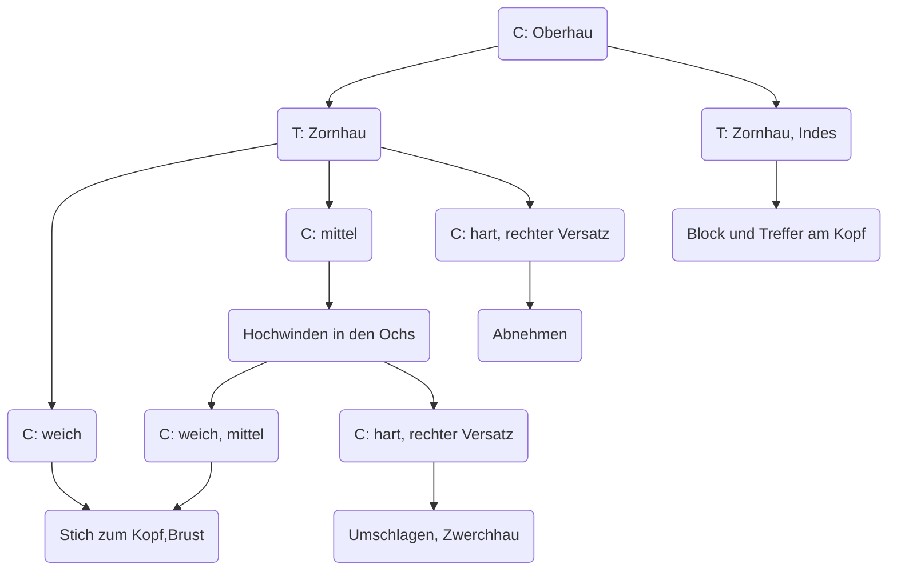

# Einleitung
Der Zornhau startet ähnlich wie der Oberhau und wird diagonal
 - von oben rechts nach unten links in den linken Pflug geschlagen
 - kann tief auch durch den linken Pflug "geschoben" werden
 - zielt vornehmlich auf das gegnerische Schwert (passiv)
 - als Meisterhau funktioniert er auch im Indes oder Vor

## Übungen zum Einstieg
- beide stehen soweit auseinander das sie sich mit leichter Vorbeuge erreichen
- spielerisch versuchen sich den anderen an der Schulter zu treffen

- einer geht seitlich mit einem Schritt raus, dreht sich in 45° Ausrichtung zum Partner, Partner bleibt dabei in seiner Ausrichtung und Position
- spielerisch versuchen sich den anderen an der Schulter zu treffen

## Partnerübungen
Die Varianten werden in langsamem Sparring ausgeführt, dabei ist immer einer in der Rolles des Coaches, der den anderen durch die Übung führt.

# Zornhau gegen Oberhau (Verteidiger bleibt im Nach)
- beide stehen in der rechten Hut vom Tag, linker Fuß vorn

> Coach greift mit einem rechten Oberhau an und macht einen ganzen Schritt nach vorn

<blockquote class="rightalign">

Trainierende wartet etwas (Timing) und schlägt einen Zornhau gegen das gegnerische Schwert (Mitte) und macht gleichzeitig einen Schritt zurück.

Hiermit wird die gegenerische Klinge nach außen und unten versetzt.

</blockquote>

# Zornhauort gegen Pflug/gerade Versatzung (Verteidiger bleibt im Nach)
Vorübung zum Zornhauort gegen den Zornhau
>Coach steht im linken Pflug, rechtes Bein vorn
<blockquote class="rightalign">

Trainierende steht in der rechten Hut vom Tag, linker Fuß vorn

Trainierende schlägt einen Zornhau zu Klinge des Verteidigers um die Zentrallinie einzunehmen. Dabei erfolgt nur ein Ziehschritt/Vorstellschritt mit dem linken Bein.

</blockquote>
>Coach reagiert nicht (oder drückt mit seiner Schwäche gegen die Stärke des Angreifers)

<blockquote class="rightalign">

Trainierende setzt mit einem Stich zur Brust nach und macht dabei einen Schritt rechten Bein

</blockquote>

# Zornhau gegen Oberhau (Verteidiger kommt ins Vor, *Indes*)
- beide stehen in der rechten Hut vom Tag, linker Fuß vorn
> Coach greift mit einem rechten Oberhau an und macht einen ganzen Schritt nach vorn

<blockquote class="rightalign">

Trainierende schlägt einen Zornhau, versucht mit seiner Stärke (näher am Parier) die Mitte des gegnerischen Schwertes zu fangen und triff gleichzeitig mit seiner Schwäche zum Kopf.

Er macht dabei einen ganzen Schritt schräg rechts vor.

</blockquote>

# Zornhauort gegen Oberhau (Verteidiger bleibt erst im Nach, kommt mit der Folgeaktion ins Vor)
- beide stehen in der rechten Hut vom Tag, linker Fuß vorn
>Coach greift mit einem rechten Zornhau/Oberhau an und macht einen ganzen Schritt nach vorn

<blockquote class="rightalign">

Trainierende schlägt einen Zornhau gegen die Fläche des gegnerischen Schwertes (Mitte) so dass die Schwertspitze leicht nach links außen. Die Aktion erfolgt im Stand, Wechselschritt geht auch.

</blockquote>

>Coach reagiert nicht

<blockquote class="rightalign">

Trainierende windet den Griff etwas aus und führt einen Stich zum  Kopf, ganzer Schritt (oder Ziehschritt) mit dem rechten Bein nach rechts vorn

</blockquote>

# Zornhauort + Abnehmen (Verteidiger bleibt erst im Nach, kommt mit der Folgeaktion ins Vor)
- beide stehen in der rechten Hut vom Tag, linker Fuß vorn
>Coach greift mit einem rechten Zornhau/Oberhau an und macht einen ganzen Schritt nach vorn

<blockquote class="rightalign">

Trainierende schlägt einen Zornhau gegen die Fläche des gegnerischen Schwertes (Mitte) so dass die Schwertspitze leicht nach links außen. Die Aktion erfolgt im Stand oder Wechselschritt.

Trainierende windet den Griff etwas aus und führt einen Stich zum  Kopf, kleinen Ziehschritt mit dem rechten Bein nach rechts vorn

</blockquote>

>Coach versetzt den Stich seitlich _weit_ nach außen

<blockquote class="rightalign">

<strong>Abnehmen</strong>: Trainierende führt die Schwertspitze nach oben und kommt in einer Kreisbewegung über den gegenerischen Ort auf seine rechte Seite

mögliche Folgeaktionen für den Trainierende: linker Oberhau zur rechten Blöße oder Arm; Winden in den rechten Ochs und Stich zum Kopf

</blockquote>

Kombinieren wir die vier vorherigen Einzelübungen, entsteht ein Entscheidungsbaum

# Zornhau gegen Zornhau - Folgetechnik Hieb mit kurzer Schneide
- beide stehen in der rechten Hut vom Tag, linker Fuß vorn
- Coach greift mit einem rechten Zornhau/Oberhau an und macht einen ganzen Schritt nach vorn
- Trainierende schlägt einen Zornhau gegen die Fläche des gegnerischen Schwertes (Mitte) so dass die Schwertspitze leicht nach links außen. Die Aktion erfolgt im Stand, oder mit einem kleinen Schritt rechts vor
- Trainierende schlägt aus der Bindung mit der kurzen Schneide zur rechten Seite des Kopfes. Dabei efolgt ein kleiner Schritt nach rechts vorn.
- Trainierende windet hoch in den Ochs und zieht sich zurück

# Konter gegen Zornhauort - Winden
- beide stehen in der rechten Hut vom Tag, linker Fuß vorn
- Coach greift mit einem rechten Zornhau/Oberhau an und macht einen ganzen Schritt nach vorn
- Trainierende schlägt einen Zornhau gegen die Fläche des gegnerischen Schwertes (Mitte) so dass die Schwertspitze leicht nach links außen. Die Aktion erfolgt im Stand
- Trainierende windet den Griff etwas aus und führt einen Stich zum  Kopf, kleinen Schritt mit dem rechten Bein nach rechts vorn
- Coach steigt mit dem linken Bein nach rechts (Übersetzen?) und windet hoch in den linken Ochs, gefolgt von einem Stich zum Kopf

# Zornhauort gegen Pflug/gerade Versatzung  (Zornhau als Einladung/Finte)
- Coach steht im linken Pflug, rechtes Bein vorn
- Trainierende steht in der rechten Hut vom Tag, linker Fuß vorn
- Trainierende schlägt einen Zornhau absichtlich in die Stärke des Coach und gibt die Zentrallinie auf. Dabei erfolgt ein Ziehschritt/Vorstellschritt mit dem linken Bein.
- Coach geht darauf ein und reagiert mit einem Stich
- Trainierende nimmt das linke Bein etwas zurück und dreht sich zum Coach, kontert mit "Hieb kurzer Schneide", oder windet hoch in den linken Ochs und sticht ebenfalls

# Kombination: Zornhau mit Auswinden gegen passives Versetzen

# Kombination: Zornhau mit Knaufstoß gegen Krone

# Kombination: Zornhauort + Abnehmen, Brüche gegen Abnehmen

# Kombination: Bruch gegen Zornhau 1 - Zucken

# Kombination: Bruch gegen Zornhau 1 - Zucken - Konter und Fortsetzung

# Kombination: Bruch gegen offensiven Zornhau (Indes) - Hochwinden in den Ochs

# Kombination (Technikkette): Zornhau - Hochwinden in den Ochs - Versetzen - Zwerchhau - Versetzen oder "Unterzwerchen"